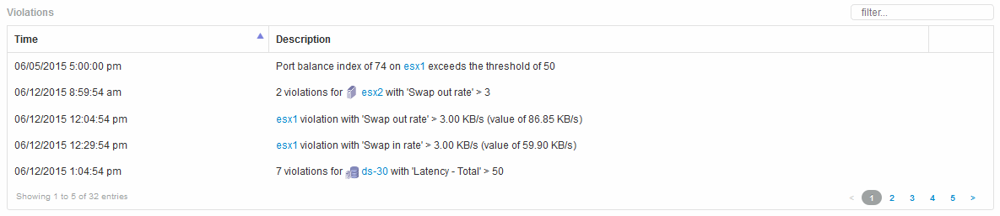

= Violations
:icons: font
:imagesdir: ../media/

[.lead]
You can use the Violations section of an asset page to see the violations, if any, that occur in your environment as a result of a performance policy assigned to an asset. Performance policies monitor your network thresholds and enable you to detect a violation of a threshold immediately, identify the implication, and analyze the impact and root cause of the problem in a manner that enables rapid and effective correction.

The following example shows aViolations section that displays on an asset page for a hypervisor:

