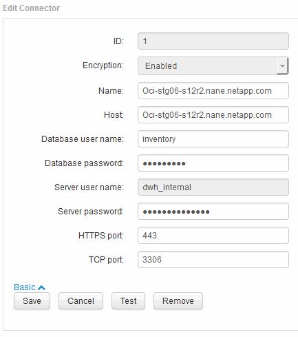

= Changing the "`inventory`" and "`dwh_internal`" passwords using the Server Connection Configuration UI
:icons: font
:imagesdir: ../media/

[.lead]
If you need to change the "`inventory`" or "`dwh_internal`" passwords to match those on the Insight server you use the Data Warehouse UI.

== Before you begin

You must be logged in as administrator to perform this task.

== Steps

. Log in to the Data Warehouse Portal at https://hostname/dwh, where hostname is the name of the system where OnCommand Insight Data Warehouse is installed.
. From the navigation pane on the left, click *Connectors*.
+
The *Edit Connector* screen is displayed.
+
image::../media/dwh_passwords1.gif[]

. Enter a new "`inventory`" password for the *Database password* field.
. Click *Save*
. To change the "`dwh_internal`" password, click *Advanced.*
+
The Edit Connector Advanced screen is displayed.
+

. Enter the new password in the *Server password* field:
. Click save.
