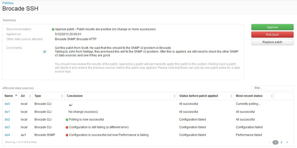

= Committing a data source patch
:icons: font
:imagesdir: ../media/

[.lead]
You use the information in the Patches summary to decide if the patch is performing as expected and then commit the patch to your network.

== Before you begin

You have installed a patch and need to decide if the patch is successful and should be approved.

== Steps

. On the Insight toolbar, click *Admin*.
. Click *Patches*.
+
If no patches are being installed, the Patches currently under review is empty.

. In *Patches currently under review*, check the status of the data source patches currently being applied.
. To examine the details associated with a specific patch, click the linked name of the patch.
. In the Patches summary information, shown in this example, check the *Recommendation* and *Comments* to assess the progress on the patch.
+

. Check the *Data sources affected* table to see the status of each affected data source before and after the patch.
+
If you are concerned that there is a problem with one of the data sources being patched, click the linked Name in the Data sources affected table.

. If you conclude that the patch should be applied to that type of data source, click *Approve*.
+
The data sources are changed and the patch is removed from Patches currently under review.
