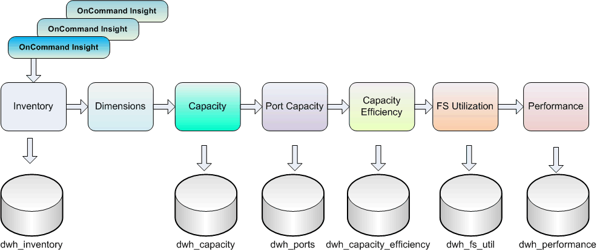

= How Data Warehouse extracts data
:icons: font
:imagesdir: ../media/

[.lead]
The Extract, Transform, and Load (ETL) process retrieves data from multiple OnCommand Insight databases, transforms the data, and saves it into the data marts.

OnCommand Insight connectors invoke a series of batch jobs to extract data from multiple OnCommand Insight mySQL databases and publish the data in various data marts, as shown in the following diagram.

The ETL process includes these individual processes:

* *Extract*
+
This process takes data from multiple OnCommand Insight databases, transforms the data, and saves it into the data mart. The process is performed against each OnCommand Insight instance at the same time. To ensure that data cleansing and deduplication is performed, it is not possible to split the ETL process into multiple scheduled ETL operations.

* *Transform*
+
This process applies business logic rules or functions to extract the data from the OnCommand Insight database.

* *Load*
+
This process loads the transformed data into public data marts.
