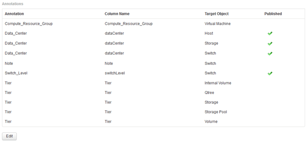

= Importing user-defined annotations into Data Warehouse
:icons: font
:imagesdir: ../media/

[.lead]
After forcing an annotation update in OnCommand Insight, you need to select the annotations you want in Data Warehouse and initiate a Data Warehouse build. You can wait until the next scheduled build or initiate a build now.

== Steps

. Log in as an administrator to the Data Warehouse Portal at `+https://hostname/dwh+`, where `hostname` is the name of the system where OnCommand Insight Data Warehouse is installed.
. From the navigation pane on the left, click *Annotations*.
+

+
The list displays a row for every annotation type and a target object to which the annotation can be assigned. A check mark in the Published column indicates that the annotation was already selected for the particular target object and is already available through the Data Warehouse data marts.

. Click *Edit* to edit how annotations will be imported from OnCommand Insight.
+
image::../media/oci_dwh_admin_annotations_edit_gif.gif[DWH Annotations Edit]

. To edit the annotation process, do the following:
 ** Select *Published* to add annotations retrieved from OnCommand Insight into the Data Warehouse database. Click *All* to select all annotations on all objects. Click *None* to ensure that all options are not selected.
+
[NOTE]
====
Uncheck this option to remove the annotation column from the specific object's inventory table and associated data marts. If any custom-designed reports use annotation data, the reports do not run successfully.
====

 ** Check *Init with Current* to initialize historical data in Data Warehouse dimension tables with the current annotation value. Click *All* to select all annotations on all objects. Click *None* to ensure that all options are not selected. This check box is disabled after an annotation is published; the check box is enabled for annotations that are not published.
For example, if a host is annotated with annotation type "`floor`" and gets the value "`1`", and there are 3 rows for that host in the host_dimension table, then selecting *Init with Current* associates the value "`1`" in the "`floor`" column for all 3 rows in the host_dimension table. If *Init with Current* is not selected, then only the latest row for that host will have the value "`1`" in the floor column.
. Click *Save*.
+
A warning message appears indicating that this will cause changes to the structure of the data or data loss, if you are removing annotations.

. To continue, click *Yes*.
+
Data Warehouse initiates an asynchronous annotations job that applies the requested changes. You can see the job in the Jobs page. You can also see the changes in the Data Warehouse database schema.
