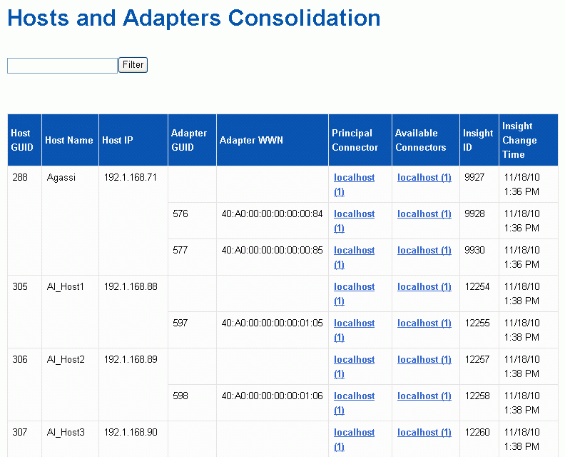

= Viewing hosts and adapters consolidation issues
:icons: font
:imagesdir: ../media/

[.lead]
The reported data for hosts and their associated adapters is derived from the Inventory data mart.

== Steps

. Log in to the Data Warehouse Portal at `+https://hostname/dwh+`, where `hostname` is the name of the system where OnCommand Insight Data Warehouse is installed.
. In the navigation pane to the left, click *Troubleshooting*.
. In the *Chassis Consolidation* section, click *Hosts and Adapters*.
+
[NOTE]
====
The configuration shown in this example is not a valid configuration. Principal and Available connectors on localhost suggest that the Insight server and DWH are both installed on the same server. The intent of this example is to familiarize you with the consolidation table.
====
+

+
For all hosts and adapters there is a row for each connector that reports on them, as well as the Primary Connector from which the host and adapter are taken. For hosts and adapters only, a host that is reported by one connector may have its adapters reported by a different connector.
+
You can also see the OnCommand Insight change time of a host/adapter for each connector. Using this parameter, you can discover when an update has occurred in OnCommand Insight for the host/adapter and when the same host/adapter has been updated in other OnCommand Insight servers.

. Optionally, filter data in this view by typing a portion of the text and clicking *Filter*. To clear the filter, delete the text in the *Filter* box and click *Filter*. You can filter by host name, host IP, adapter WWN, or OnCommand Insight object ID.
+
The filter is case sensitive.

. Review the following data:
 ** *Host GUID*
+
Global Unique Identifier for this type of consolidated device (hosts)

 ** *Host Name*
+
Name of the consolidated host as it appears in the data warehouse

 ** *Host IP*
+
IP address of the consolidated host

 ** *Adapter GUID*
+
Global Unique identifier for the host adapter

 ** *Adapter WWN*
+
WWN of the host adapter

 ** *Principal Connector*
+
Name of the OnCommand Insight connector that was the actual source of the data

 ** *Available Connectors*
+
All OnCommand Insight connectors where the consolidated host / adapter reside

 ** *Insight ID*
+
OnCommand Insight ID of the consolidated host/adapter for the relevant reporting connector

 ** *Insight Change Time*
+
When an update has occurred in OnCommand Insight for the host/adapter and when the same host/adapter has been updated in other OnCommand Insight servers
. To obtain detail about the connector, click on the connector.
+
You can see the following information for the connector:

 ** Host name
 ** The last time a Data Warehouse job was run on that connector
 ** The last time a change was received from that connector
 ** The version of the OnCommand Insight server pointed to by that connector
