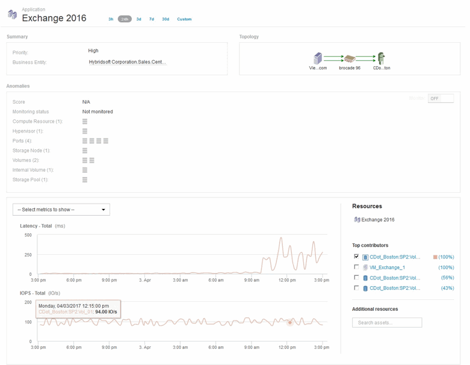

= Analyzing an application performance problem
:icons: font
:imagesdir: ../media/

[.lead]
This document describes steps you might take to address reports of performance problems for an application that are impacting users or administrators. For example, users are complaining that their Exchange application is experiencing periods of slowness throughout the day.

== About this task

In OnCommand Insight, an application is a configured entity. You assign a name and business entity to the application and you assign compute and storage resources to the application. This allows a better end-to-end view of infrastructure health and more pro-active management of infrastructure asset management.

== Steps

. To begin investigating the issue, use the Insight toolbar to perform a global search for the Exchange application.
+
image::../media/search-exchange.gif[]
+
[TIP]
====
When performing a search, you can add an object descriptor before the object name to refine the search results.
====

. When you select "Exchange 2016" from the search results, the system displays the Application landing page.
+

+
In the Application landing page, the following information is of interest:

 ** In the 24-hour time period selected, an increase in latency is shown on the right of the latency graph.
 ** During the period of increased latency there is no significant change in the level of IOPS. It appears the latency increase is not caused by a heavier application usage. We are not really seeing a high IOPS demand on the storage that could account for the latency spike. The increase in latency could be due to an external factor.
 ** On the right of the charts in the Top contributors section, click on the 100% for the selected internal volume (CDot_Boston:SP2:Vol_01). The system shows this resource is contributing 100% to the Exchange 2016 application. image:../media/top-contributor.gif[]
 ** Click on the navigation link for this internal volume (CDot_Boston:SP2:Vol_01) to access the internal volume landing page. Analysis of the internal volume might provide information pertaining to the latency spike.
