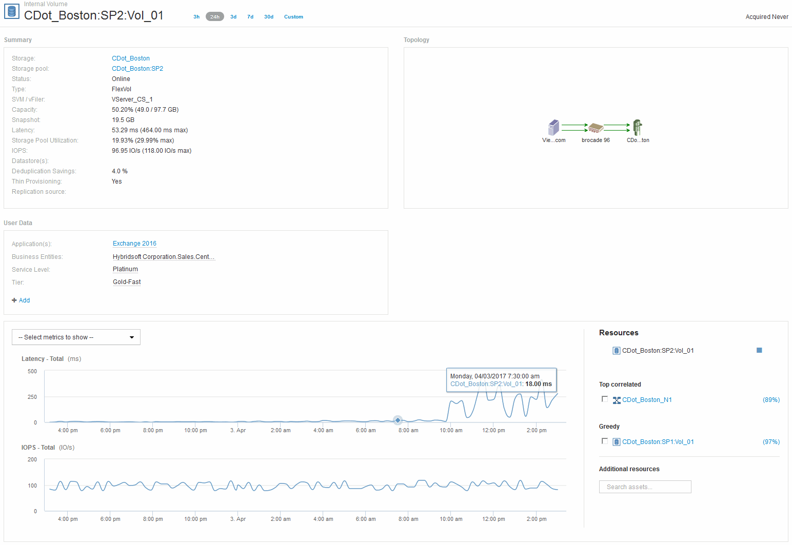

= Examining the internal volume
:icons: font
:imagesdir: ../media/

[.lead]

In the Internal Volume landing page, you see:

* The performance charts for the internal volume match what was previously seen for the application performance for both latency and IOPS.
* In the Resources section, where the correlated assets are displayed, a "`Greedy`" resource is identified (CDot_Boston:SP1:Vol_01).

A greedy resource is identified by insight correlation analytics. Greedy/degraded resources are "`peers`" that utilize the same shared resource. The greedy resource has IOPS or utilization rates that negatively impact the degraded resource's IOPS or latency.

Greedy and Degraded resources can be identified on Virtual Machine, Volume, and Internal Volume landing pages. A maximum of two greedy resources will be displayed on each landing page.

Selecting the correlation ranking (%) provides the Greedy resource analysis findings. For example, clicking a greedy percentage value identifies the operation on an asset that impacts the operation on the Degraded asset, similar to what is shown in the following example.

image::../media/greedy_percentage.gif[]

When a degraded resource is identified, you can select the degraded (%) score to identify the operation and the resource that is impacting the degraded resource.

image::../media/guid_13582cf7_aedf_47d1_935e_edc7c5b1b921.gif[]
