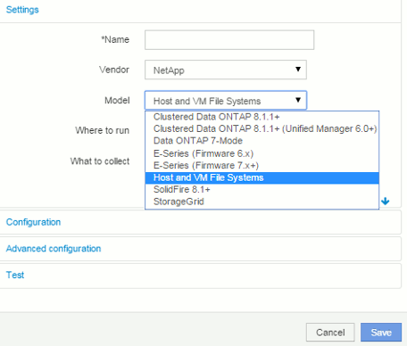

= Configure Insight for file system collection
:icons: font
:imagesdir: ../media/

[.lead]
To configure Insight for collection of file system utilization data, you must install the Host Utilization Pack license and configure the NetApp Host and VM File Systems data source.

== Before you begin

If you haven't already, install the Host Utilization Pack license. You can check for the license in the *Admin* > *Setup* page, on the *Licenses* tab.

The Host and VM File Systems data source only reports file system utilization and file system metadata for known *Compute Resources* (hosts and VMs) currently being collected or discovered in Insight:

* Virtual Machines are collected by hypervisor data sources such as Hyper-V and VMware.
* Hosts are discovered via device resolution.

The proper Tier annotations must be present on the appropriate storage resources.

The following connected block storage devices are supported:

* NetApp Clustered Data OnTap (cDOT)
* NetApp 7-Mode
* Clariion
* Windows: VMWare virtual disks (VMDKs) for FC, iSCSI
* Linux: VMWare VMDKs (iSCSI and FC not supported)

A *Compute Resource Group* is an annotation that allows grouping of hosts and/or virtual machines that share a common administrative credential.

== Steps

. First, annotate the hosts and/or virtual machines to be included in your *Compute Resource Group*. Go to *Queries* > *+New query* and search for _Virtual Machine_ assets.
+
You will need to repeat these steps for _Host_ assets.

. Click on the column selector on the right of the table and select the *Compute Resource Group* column to display it in the query results table.
. Select the virtual machines you wish to add to the desired compute resource group. You can use a filter to search for specific assets.
. Click on the *Actions* button and choose *Edit annotation*.
. Select the _Compute Resource Group_ annotation, then choose the desired resource group name in the _Value_ field.
+
The resource group annotation is added to the selected VMs. The resource group name must match the name you will configure in the Host and VM File Systems data source later.

. To configure the Host and VM File Systems data source for a compute resource group, click on *Admin* > *Data sources* and *Add* the _NetApp Host and VM File Systems_ data source.
+

. In the *Configuration* section, enter a *User Name* and *Password* for an operating system user with appropriate rights to retrieve file system data. For Windows operating system users, this must include the domain prefix if your Windows environment uses it.
+
Note that an Insight Acquisition Unit (AU) installed on Linux can report on Linux compute resources, while an AU installed on Windows can talk to either Linux or Windows compute resources.

. Enter the name of the *Compute Resource Group* for the assets from which you will want to collect file system utilization data. This name must match the resource group name you used to annotate the assets above.
+
If you leave the Compute Resource Group field empty, the data source will collect data for hosts or VMs that have no Compute Resource Group annotation.

. In the **Advanced Configuration**section, enter the desired polling interval for this data source. The default of 6 hours is usually adequate.
. It is recommended to *Test* the data source connection before saving it. A successful connection result will also show you how many compute resource targets are contained in the group.
. Click *Save*. The Host and VM File Systems data source will begin collecting data on its next poll.
. Once file system data is being collected, you can view it on the host's or VM's asset page, in the File System widget:
+
image::../media/hostutil-vmlpfstable.gif[]

. Repeat these steps for each Compute Resource Group you will have. Each compute resource group must be associated with its own Host and VM File Systems data source.
+
Note that file system information will be collected for hosts and VM's that are already being acquired by any traditional VMware or Hyper-V data sources in your environment.
