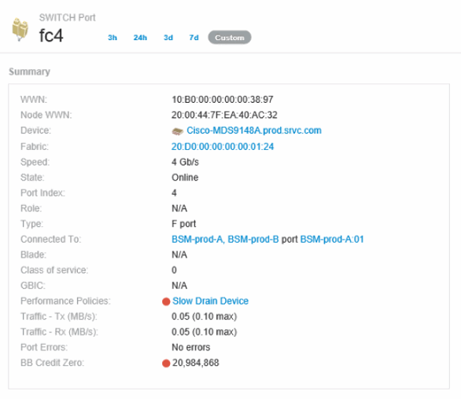

= Creating performance policies and thresholds for ports
:icons: font
:imagesdir: ../media/

[.lead]
You can create performance policies with thresholds for metrics associated with a port. By default, performance policies apply to all devices of the specified type when you create them. You can create an annotation to include only a specific device or a set of devices in the performance policy. For simplicity, an annotation is not used in this procedure.

== Before you begin

If you want to use an annotation with this performance policy, you must create the annotation before you create the performance policy.

== Steps

. From the Insight toolbar, click *Manage* > *Performance policies*
+
The existing policies are displayed. If a policy exists for switch ports, you can edit the existing policy, adding the new policies and thresholds.

. Edit an existing port policy or create a new port policy
 ** Click the pencil icon at the far right of the existing policy. Add the thresholds described in steps "`d`" and "`e`".
 ** Click *+Add* to add a new policy

 .. Add a "`Policy Name`": Slow Drain Device
 .. Select port as object type
 .. Enter First occurrence for "`Apply after window`" of
 .. Enter threshold: BB credit zero - Rx > 1,000,000
 .. Enter threshold: BB credit zero - Tx > 1,000,000
 .. Click "`Stop processing further policies if alert is generated`"
 .. Click "`Save`"

+
The policy you create monitors the thresholds you set over a period of 24 hours. If the threshold is exceeded a violation is reported.
. Click *Dashboards* > *Violations Dashboard*
+
The system displays all of the violations that have occurred on the system. Search or sort the violations to view the "`Slow Drain Device`" violations. The Violations Dashboard shows all of the ports that experienced BB Credit 0 errors exceeding the thresholds that were set in the performance policy. Each switch port identified in the violations dashboard is a highlighted link to the Port Landing Page.

. Click on a highlighted port link to display the Port Landing Page.
+
The port landing page is displayed and includes information useful for BB Credit 0 troubleshooting:

 ** Devices the port is connected to
 ** Identification of the port reporting the violation, which is a Fiber Channel Switch port.
 ** The port's speed
 ** The associated node and port name

. Scroll down to view the port metrics. Click *Select metrics to show* > *BB credit zero* to display the BB credit graph.
+
image::../media/expert-port-metrics.gif[]

. Click *Top correlated*
+
The top correlated resource analysis shows the connected controller node the port is servicing as the resource most correlated with performance. This step compares the IOPS metrics of the port activity with the overall node activity. The displays shows the Tx and Rx BB Credit Zero metrics and the controller node's IOPS. The display shows the following:

 ** The controller IOs are highly correlated with the port traffic
 ** The performance policy is violated when the port is transmitting IO to the server.
 ** Given that our port performance violation is occurring in conjunction with a high IOPS load on the storage controller it is likely that the violation is due to the workload on the storage node.
image:../media/port-node-compare.gif[]

. Return to the Port Landing Page and access the storage controller node's landing page to analyze the workload metrics.
+
The Node shows a utilization violation and metrics show high "cache reads replaced" that correlates to buffer-to-buffer zero credit states.
+
image::../media/node-landing-page.gif[]

. From the Node landing page, you can compare the BB credit zeroes by selecting the port from the correlated resources list, and select utilization data, including Cache utilization data, for our node from the metrics menu.
+
image::../media/node-port-comparison.gif[]
+
This data makes it clear that the Cache hit Ratio is inversely correlated to our other metrics. Instead of being able to respond to the server load from cache, the storage node is experiencing high cache reads replaced. It is likely that having to retrieve most of the data from disk rather than cache is causing the delay in the port's transmission of data to the server. The cause of the performance problem appears likely to be a workload generated change in IO behavior, and that the node cache, and its configuration, are the cause. The problem might be solved by increasing the node's cache size or change the caching algorithm's behavior.
