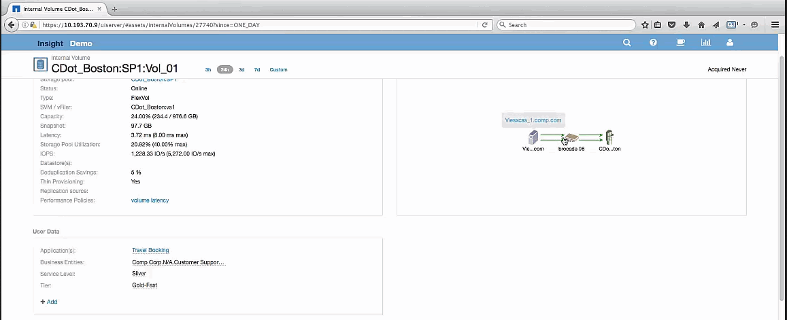

= Examining the greedy resource
:icons: font
:imagesdir: ../media/

[.lead]
Clicking on the internal volume identified as the greedy resource opens the landing page for the volume CDot_Boston:SP1:Vol_01.

Note in the summary details this internal volume is a resource for a different application (Travel Booking) and although contained in a different storage pool is on the same node as the internal volume for Exchange 2016 (CDot_Boston_N1)

image::../media/cdot-boston-sp1-part2.gif[]

The landing page shows:

* The internal volume associated with a Travel Booking application.
* A new storage pool is identified in the correlated resources.
* The original internal volume you were examining (CDot_Boston:SP2:Vol_01) is identified as "`Degraded`".
* In the performance graph, the application has a steady latency profile and does have an IOPS spike roughly at the same time we see the latency spike on the Exchange application.
+
This might indicate that the latency spike on the Exchange application is likely caused by the IOPS spike on this volume.

To the right of the charts in the Resource section notice the correlated Degraded resource which is the Exchange 2016 internal volume (CDot_Boston:SP2:Vol_01). Click on the check box to include the degraded internal volume in the in the performance graphs. Aligning the two performance graphs shows that the latency and IOPS spikes occur at nearly the exact same time. This tells us that we want to get a better understanding of the Travel Booking application. We need to understand why the application is experiencing such a prolonged IOPS spike.

Examining the Storage pool associated with the Travel Booking application might identify why the application is experiencing the IOPS spike. Click CDot_Boston:SP1 to view the Storage Pool landing page.
