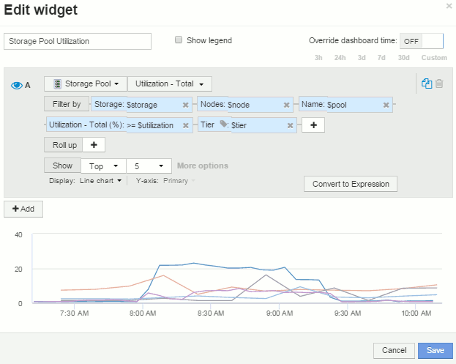

= Node dashboard example widget settings
:icons: font
:imagesdir: ../media/

[.lead]
Widget settings for the node dashboard with variables example.

Following are the settings for each of the widgets in the storage node dashboard example.

Node utilization:

image:../media/nodeutilchart.gif[] image:../media/nodeutiltable.gif[]

Node latency:

image:../media/nodelatencychart.gif[] image:../media/nodelatencytable.gif[]

Storage pool utilization:

 image:../media/poolutiltable.gif[]

Storage pool throughput:

image:../media/poolthroughputchart.gif[] image:../media/poolthroughputtable.gif[]

Volume latency:

image:../media/vollatencychart.gif[] image:../media/vollatencytable.gif[]

Volume IOPS:

image:../media/voliopschart.gif[] image:../media/voliopstable.gif[]
