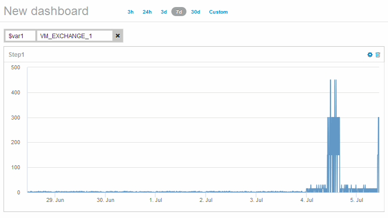

= Observe an object's behavior over time
:icons: font
:imagesdir: ../media/

[.lead]
You can observe the behavior of a single object to determine if the object is operating within expected operational levels.

== Steps

. Use a query to identify the VM that will be the subject of analysis: *Query* > *+ New query* > *Virtual machine* > *"name"*
+
Leaving the name field blank returns all VMs. Select the VM that you want to use in this exercise. You can select it by scrolling through the list of VMs.

. Create a new dashboard for the information you want to collect. From the toolbar, click *Dashboards* > *+New Dashboard*.
. In the new Dashboard, select *Variable* > *Text*.
 .. Add the VM name from your query as the``$var1`` value.
 .. Click the check box.

+
The variable is used to easily swap between different sets of objects you want to analyze. In other steps of your analysis, you may reuse this variable for additional analysis against the single VM initially chosen. Variables become more useful when identifying multiple objects.
. Add a line chart widget to the new dashboard: *Widget* > *Line chart*.
 .. Change the default asset type to virtual machine: Click *Virtual machine* > *Latency-Total*.
 .. Click *Filter by* > *Name* > *$var1*.
 .. Change the time period on the dashboard: *Override dashboard time* > *On* > *7 days*.

+
You can change the duration of the display using any of the preset selections or by specifying a custom time range.
+
The dashboard displays the VM's *IOPS-Total* for the period of time you specify.
. Assign a name to the widget and save the widget.

== Results

Your widget should contain data similar to the following: 

The VM shows a period of abnormally high latency for a short period of time in the 7 days that are displayed.
