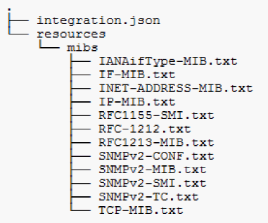

= Collecting SNMP Integration data
:icons: font
:imagesdir: ../media/

[.lead]
The integration SNMP data source allows you to collect generic SNMP data in OnCommand Insight.

== Integration packs

The SNMP Integration data source uses an "`Integration Pack`" to define what integration values are collected, and what SNMP objects provide those values.

An Integration Pack consists of:

* A JSON configuration file (integration.json) defining integration payload contents in terms of SNMP objects of a specific device type (switch, router, and so on).
* A list of MIB files that the integration pack depends on.

An integration pack can define multiple data types. For example, when integrating an RHEL host, a data type can be defined for the general system information such as uptime, number of users, and number of running processes, a second data type can be defined for data on memory and file system usage. In general, each data type must be "`flat`" and cannot contain nested data.

A single integration pack should not define more than 24 data types. Insight limits the amount of integration data that is collected. Attempting to ingest more than 24 reports over a period of one minute results in a rate error.

The names for integration types must adhere to the following rules:

* The name cannot start with the following characters: _, -, or,+
* The name cannot contain the following characters: #, \, /, *, ?, ", <, >, |, ' , `,
* Cannot be longer than 100 UTF-8 encoded bytes
* Cannot be named . or ..

== Integration file format

An integration pack is a ZIP file that contains a JSON configuration file (integration.json) defining the integration payload contents in terms of SNMP objects. It also contains a MIBS folder that contains all of the MIB files and their MIB dependencies.

The `integration.json` file must exist at the top level of the ZIP file and the MIB files must exist in the "resources/mibs" subdirectory within the ZIP. The ZIP file may also contain files, such as a "readme.txt", if desired. An example of integration ZIP structure is:

