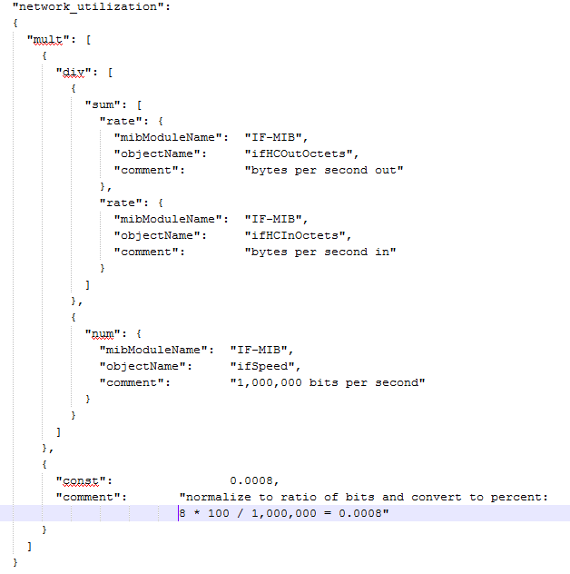

= Integration.json file information
:icons: font
:imagesdir: ../media/

[.lead]
The integration.json file identifies the payload .

The following illustration provides a color-coded representation of a simple integration.json file. The accompanying table identifies the function of the objects in the file.

image::../media/color_code_example.gif[]

== About integration.json files

Each field has the following characteristics:

* The "identifiers" section forms a unique compound key to create a new "object" in Insight
* The "attributes" provide supporting meta-data about the object.
+
In both of these cases, only the value of the latest report for that object (identified by the identifiers) is preserved.

* The "dataPoints" are time-series data and must be numeric values. Insight keeps each and every value reported here for 90 days (by default) and links them time-series to the object identified.

== Numeric Expressions

By default, all value expressions are reported as strings in the integration payload. "identifiers" and "attributes" may only define string values. "dataPoints" may define string or numeric values. Numeric values are defined using one of the following modifier keys:

* num - the total number of bytes received since the counter was last initialized
* delta - the number of bytes received during the poll interval
* rate - the average receive rate during the poll interval in bytes per second
+
An average receive rate during the poll interval in megabytes per second can be accomplished using a combination of rate and math operations

== Math operations

The `integration.json` file supports the following math operations: add, subtract, multiply, divide. The following example shows multiplication, division, and sum operations in a JSON file.

== Keywords

An integration pack keyword, string, is implemented to force OCTET STRINGs or proprietary types derived from OCTET STRING that would normally be rendered in hexadecimal format to instead be rendered as ASCII characters.

Often OCTET STRINGs contain binary data, for example MAC addresses and WWNs:

----
        "interface_mac": {
                  "mibModuleName":      "IF-MIB",
                  "objectName":         "ifPhysAddress"
                 }
----

ifPhysAddress is type PhysAddress, which is just an OCTET STRING:

----
  PhysAddress ::= TEXTUAL-CONVENTION
                DISPLAY-HINT "1x:"
                STATUS       current
                DESCRIPTION
                                "Represents media- or physical-level addresses."
                SYNTAX       OCTET STRING
----

When ifPhysAddress is rendered as hex by default, the result is:

----
"interface_mac": "00:50:56:A2:07:E7"
----

However if you have an OCTET STRING or proprietary type derived from OCTET STRING that you want to interpret as ASCII, you can use the "string" keyword:

----
        "string_test_1": {
          "string": {
            "mibModuleName":      "IF-MIB",
            "objectName":         "ifPhysAddress"
          }
        },

        "string_test_2": {
          "string": [
            {
              "mibModuleName":      "IF-MIB",
              "objectName":         "ifPhysAddress"
            },
            {
              "const": "JSD"
            },
            {
              "mibModuleName":      "IF-MIB",
              "objectName":         "ifPhysAddress"
            }
          ]
        }
----

The keyword follows the existing string concatenation rules, inserting a single space between terms in the following example:

----
      "string_test_1": "PV¢ç",
              "string_test_2": "PV¢ç JSD PV¢ç"
----

The "string" keyword acts on a single term or a list of terms, but not nested expressions. Nested expressions are only supported for dataPoint expressions. Attempting to use a "string" expression in a dataPoint expression will result in an error similar to the following:

_java.lang.IllegalArgumentException: Integration pack 'GenericSwitch32' index 'snmp_generic_interface_32' section 'dataPoints' key 'string_test_3' unsupported JSON numeric expression '{"string":{"mibModuleName":"IF-MIB","objectName":"ifPhysAddress"}}'_

Some derived OCTET STRING types such as DisplayString, SnmpAdminString have hard-coded precedence over the "string" keyword. This is because SnmpAdminString is specifically UTF-8 encoded, and we want to handle it correctly, whereas the "string" keyword forces the default string representation returned by the snmp_framework, which assumes single byte ascii code points per character.
