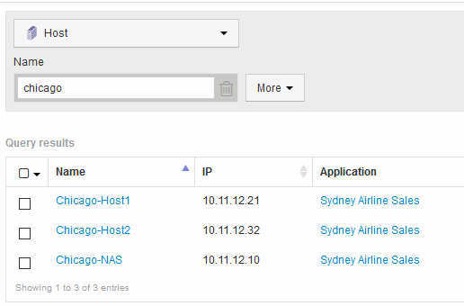

= Assigning applications to an asset using a query
:icons: font
:imagesdir: ../media/

[.lead]
You assign an application to an asset so that you can identify the resources of the asset that the application uses. If an asset has a cost assigned to it you can identify the cost that is incurred by the application and if the resource is measured by size, you can determine if the resource will need to be replenished.

== About this task

You can simplify the task of assigning multiple assets to an application by using a query.

== Steps

. Create a new query to identify the assets you want to assign an application to. For example, if you want to assign it to a host with a specific name that relates to a geographic location, Click *Queries* > *+New Query*
. Click *Host*
. In the *Name* field, enter `Chicago`
+
The system displays all of the Hosts with `Chicago` as part if their name. 

. Select one or more of the Hosts identified by your query.
. Click *Actions* > *Add Application*
+
image::../media/application_assign.gif[]
+
The system displays the Assign application dialog.

. Select the Application you want to assign to the Host and click image:../media/check_box_ok.gif[]
. Click *Save*
+
The application name appears in the User Data section.
