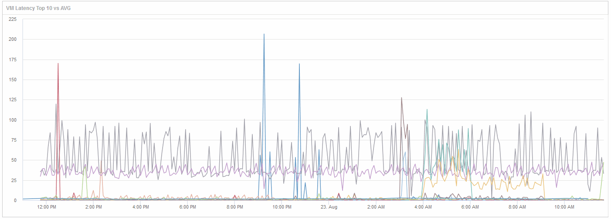

= Compare objects with the top 10 latency total to the average latency for all like objects
:icons: font
:imagesdir: ../media/

[.lead]
You might want to compare the VMs with the top 10 latency total to the average latency total to identify any that are extremely out of the average range. This information could help in decisions to balance workloads on VMs.

== Steps

. Add a widget with a stacked area chart to the to the new dashboard: *Widget* > *Stacked Area Chart*
 .. Change the default device to Virtual machine: Click *Storage* > *Virtual machine* > *Latency total*
+
The widget displays the Latency Total, for all VMs, for 24 hours in a stacked area chart.

 .. Create a second display in this widget that shows Latency Total averaged for all VMs: *Widget* > *Line chart*
 .. Change the default device to Virtual machine: Click *Virtual machine* > *Latency-total*
+
The widget displays the Latency Total for the default 24 hour period of time using a line chart.

 .. Click *X* on the *Roll up* bar and select *Show* > *Top* > *10*

+
The system displays the Top 10 VMs based on Latency Total.
. To compare the average Latency Total for all VMs to the Top 10 IOPS total use the following steps:
 .. Click *+Add*
 .. Change the default device to Virtual machine: Click *Storage* > *Virtual machine* > *IOPS total*
 .. Click *X* on the *Roll up* bar and select *Show* > *Top* > *10*

+
The system displays the 10 objects with high latency and shows the average latency in a line chart.
+

+
The average latency is 1.6 ms, while in the top ten, the are VMs experiencing latency of over 200 ms.
