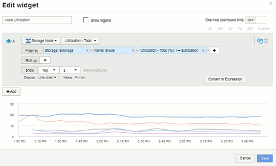

= Example storage node utilization dashboard with variables
:icons: font
:imagesdir: ../media/

[.lead]
Create a custom dashboard for Storage Analysis which has variables for storage, storage pool, node, tier, utilization and latency.

== Before you begin

Familiarity with dashboards in Insight is recommended but not required.

== About this task

The following procedure will create a custom Storage Analysis Overview dashboard which uses variables for storage, storage pool, node, tier, utilization and latency. Variables in the example below will be used to filter the displayed assets or metrics across one or many widgets available on the dashboard. The widgets that use these variables as filters will be updated with filtered content on-demand according to the values entered in the variable fields on the dashboard, allowing you to quickly filter multiple charts and graphs to drill down to a specific area of interest.

By following the steps in this example, you will create a dashboard like the following. You can change these widgets, or add any number of additional widgets, to highlight any data you choose.

image::../media/node_dashboard_example_2.gif[]

== Steps

. Create a new dashboard, and name it "`Analysis: Storage Overview`", or something equally descriptive.
. Click on the *Variable* drop-down and select *Text* variable type. By default, the variable is named _$var1_. Click on _$var1_ to edit the name, and change it to _$storage_, then click the check mark to save the variable. Repeat to create text variables for _$node_, _$pool_, and _$volume_.
. Repeat the above process to create *Number*-type variables named _$utilization_ and _$latency_.
. Click on the *Variable* drop-down and search for the _Tier_ annotation. Select it to create a variable named _$tier_.
+
You can add variables at any time, however it is easier to create them up front and therefore make them available to all widgets as you create them.

. Add a widget by clicking on the *Widget* drop-down and selecting either a **line chart**or *area chart* widget. Name the widget "`Node Utilization`". Click on the *Storage* asset type and change it to *Storage Node*. Select *Utilization - Total* for the chart data.
. Click on the *Filter by +* button to add a filter. Search for and select *Storage*, then click on *Any* and select the _$storage_ variable.
. Click the**+**button to add another filter for *Name*. Set the variable to _$node_.
+
Different variables can be assigned to the annotation name filter. Use the name/variable pair at the lowest level depending on the object in the widget. For example:

 ** You can assign the _$node_ variable to the *Name* filter for a Node-focused widget.
 ** You can assign the _$pool_ variable to the *Name* filter for a Pool-focused widget.

. Click the**+**button to add another filter for *Utilization - Total (%)*. Set the variable to _>= $utilization_.
. Click the *X* after the**Roll up** field to collapse the field.
. Select *Show Top 5* and click *Save* to save the widget and return to your Dashboard.
+
Your widget should look something like this:
+

. Add another line or area chart widget to your dashboard. Select *Storage Node* as the asset type and *Latency - Total* as the metric to chart.
. Click on the *Filter by +* button to add filters for *Storage: $storage* and *Name: $node*.
. Add a filter for *Latency - Total* and select the *$latency* variable.
. Name the widget "`Node Latency`" and save it.
. You can add supporting tables to show more details for the charts you created, for example, Max or Avg node utilization. Add a *Table widget* to the dashboard and select *Storage Node* as the asset type, and create filters for *Storage: $storage*, *Name: $node*, and *Utilization - Total: $utilization*.
. Add columns to the table for *Utilization - Max*, *Utilization - Total*, or any other desired columns.
. Name the widget "`Node Peak and Avg Utilization`" and save it.
+
image::../media/nodeutiltablesettings.gif[]

. Repeat the steps to create a table for Node Latency, showing *Latency - Max*, *Latency - Total*, or other columns as desired.
. To round out your dashboard, you might add additional chart and table widgets for some or all of the following:
 ** |===
| Chart| Table
a|
Storage Pool Utilization
a|
Storage Pool Peak and Avg Utilization
a|
Storage Pool Throughput
a|
Storage Pool Peak and Avg Throughput
a|
Volume Latency
a|
Volume Peak and Avg Latency
a|
Volume IOPS
a|
Volume Peak and Avg IOPS
|===
. You can move and resize the widgets in whatever placement you want on your dashboard. When finished, be sure to *Save* the dashboard.
+
Your final dashboard will look something like this:
+
image::../media/node_dashboard_example_2.gif[]

. You can use the variables to focus on specific assets in your dashboard. As you enter values into the variable fields, your widgets update automatically to reflect those variables. For example, by entering "`15`" in the $utilization variable field, the widgets using that variable update to show only assets with total utilization >= 15%.
+
Node utilization widget showing top 5 of all nodes:
+
image::../media/nodeutil_unfiltered.gif[]
+
Node utilization widget showing nodes with 15% or greater utilization:
+
image::../media/nodeutil_filtered.gif[]

. Keep in mind the following when creating your widgets:
 ** The $tier variable will only impact resources that are annotated with the *Tier* annotation.
 ** Not all filters will impact all widgets, depending on whether the widget is designed to accept the variable(s) specified.
 ** Number variables are applied as "`greater than or equal to`" the value specified.
Note that any variable can be used as a filter on any widget at any level in a storage hierarchy, as long as the variable is valid for the asset against which the widget is running. As you move down from a Node level to Storage Pool to a Volume widget, more variables are present for assignment as filters. For example, at a Storage Node level widget, the _Storage_ and _Name_ variables can be assigned as filters. At a Storage Pool level, _Storage_, _Nodes_, _Storage Pools_ and _Name_ are all available. Assign your variables as appropriate and use the $name variable at the lowest level in the stack. Doing this will allow your $name variable to filter on the actual name of the asset against which the widget is running.
