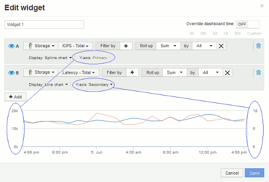

= Primary and Secondary axis explained
:icons: font
:imagesdir: ../media/

[.lead]
The secondary axis makes it easier to view data from two different sets of values that use different units of measurement.

== About this task

Different metrics use different units of measurements for the data they report in a chart. For example, when looking at IOPS, the unit of measurement is the number of I/O operations per second of time (IO/s), while Latency is purely a measure of time (milliseconds, microseconds, seconds, etc.). When charting both metrics on a single line chart using a single set a values for the Y-Axis, the latency numbers (typically a handful of milliseconds) are charted on the same scale with the IOPS (typically numbering in the thousands), and the latency line gets lost at that scale.

But it is possible to chart both sets of data on a single meaningful graph, by setting one unit of measurement on the primary (left-side) Y-axis, and the other unit of measurement on the secondary (right-side) Y-axis. Each metric is charted at its own scale.

== Steps

. Create or open a dashboard. Add a *line chart*, *spline chart*, *area chart* or *stacked area chart* widget to the dashboard.
. Select an asset type (for example *Storage*) and choose *IOPS - Total* for your first metric. Set any filters you like, and choose a roll-up method if desired.
+
The IOPS line is displayed on the chart, with its scale shown on the left.

. Click *+Add* to add a second line to the chart. For this line, choose *Latency - Total* for the metric.
+
Notice that the line is displayed flat at the bottom of the chart. This is because it is being drawn at the same scale as the IOPS line.

. In the Latency query, select *Y-Axis: Secondary*.
+
The Latency line is now drawn at its own scale, which is displayed on the right side of the chart.
+

